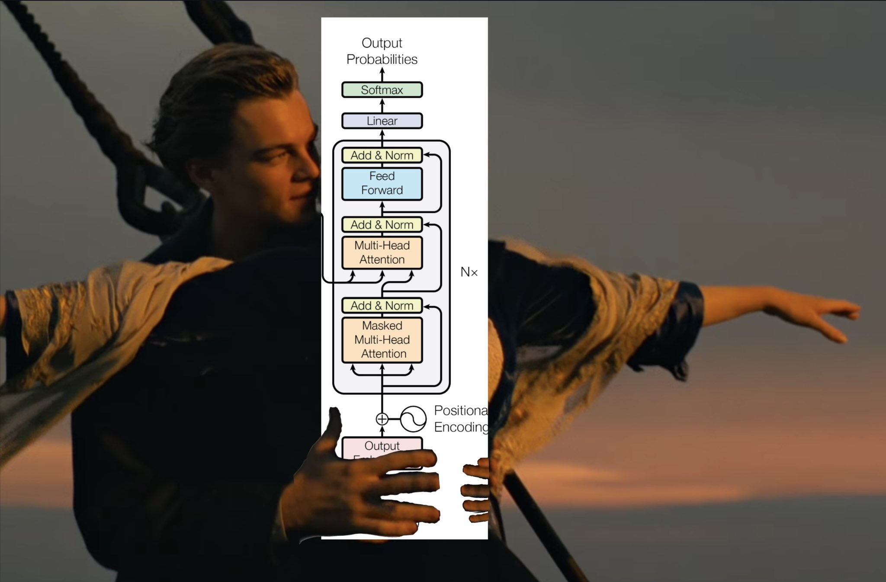

# Transformers-Practice
My hands-on learning experience with transformers (GPTs)

## Learning Roadmap
<a href="https://github.com/Jaykef/GPT-Practice/tree/main/GPT-Basic" >1. GPT Basics - definition, code implementation, use guide</a>

<a href="https://github.com/Jaykef/GPT-Practice/tree/main/GPT-Advance" >2. GPT Advance - high level overview, research papers, applications </a>

<a href="https://github.com/Jaykef/GPT-Practice/edit/main/README.md#:~:text=GPT%2D-,Basic,-GPT%2DIntermediate" >3. Huggingface Transformer - provides APIs and tools to easily download and train state-of-the-art pretrained models </a>

<a href="https://github.com/Jaykef/GPT-Practice/edit/main/README.md#:~:text=GPT%2D-,Basic,-GPT%2DIntermediate" >4. GPT Apps - real life applications of GPT (e.g ChatGPT, Jarvis) </a>

## References
1. Learning Roadmap
   <ul>
      <li><a href="https://arxiv.org/pdf/1706.03762.pdf"> Attension is All You Need Paper - Google</a> </li>
      <li><a href="https://jalammar.github.io/illustrated-transformer/"> The Illustrated Transformer - by Jay Alammar </a> </li>
      <li><a href="http://nlp.seas.harvard.edu/2018/04/03/attention.html">The Annotated Transformer - Harvard NLP</li>
      <li><a href="https://openai.com/research/techniques-for-training-large-neural-networks"> Techniques for training large neural networks - Open AI</li>
      <li><a href="https://karpathy.ai/stateofgpt.pdf"> The State of GPT - Andrej Karpathy</li>
      <li><a href="https://arxiv.org/pdf/1607.06450.pdf"> Layer Normalization - Google</li> 
      <li><a href="https://en.wikipedia.org/wiki/Matrix_multiplication"> Matrix multiplication - Wikepedia</li> 
   </ul>
   
   
3. Repos
   <ul>
      <li><a href="https://jalammar.github.io/illustrated-transformer/"> nonoGPT </a> - by Andrej Karpathy
      <li><a href="https://github.com/tensorflow/tensor2tensor">Tensor2Tensor - Tensorflow implementation of the transformer</li>
   </ul>
